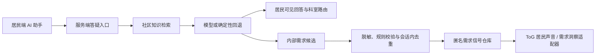

# 居民答疑 Agent → 社区匿名需求桥接架构

> 状态：PR #6 两阶段融合规格。
> 目标端：ToC 居民端 + ToG 社区电脑端。
> 核心约束：自动匿名记录，不询问提交；居民端不显示记录或受理结果；匿名信号仅社区端可见。

## 1. 目标链路



居民端和内部桥接层必须是两个输出通道：

- **公开通道**：回答、来源、未知项、允许公开的科室路由。
- **内部通道**：经策略校验的匿名需求信号。

公开通道不携带 `signalId`、记录结果或受理状态，避免居民端出现隐含提交回执。

## 2. PR #6 两阶段范围

### 阶段一：居民答疑内核与稳定桥接

目标：在当前居民端上证明 Agent 行为和匿名记录规则，不重构现有居民端主体。

范围：

- 由外层 adapter 或 portal 挂载居民 AI 助手，避免继续扩写居民端大型 `App.tsx`。
- 建立服务端模型代理、模拟 FAQ、服务/活动知识快照和白名单科室名录。
- 实现公开回答结构、内部需求候选、PII 脱敏、触发规则、会话内去重和确定性回退。
- 建立 `AnonymousDemandSignalV1` 与 `DemandRepository` 接口。
- P0 使用同源浏览器存储完成演示；居民界面不读取或展示匿名信号列表。
- 用自动化测试证明：完整回答不记录、明确缺口自动记录、重复追问不重复、PII 不落库。

不在阶段一做：

- 正式工单、实名留言、居民回访、联系方式采集。
- 云数据库、真实登录、跨设备同步和生产权限。
- 完整向量检索、运营报表或居民画像。

### 阶段二：ToG 电脑端适配与最终上游同步

目标：让同一匿名需求信号在社区电脑端成为可理解的“居民声音”，并承受两端后续 UI 更新。

范围：

- 将 `TOG-Linkhood` 固定快照作为 pristine subtree 使用，不在 vendor 内做私有修改。
- 在 ToG 上游增加最小集成端口，例如 `externalDemandSignals` 和需求页面初始入口；上游合并后再同步 subtree。
- 集成 adapter 把共享契约映射到 ToG 当前需求/反馈展示模型。
- 社区端展示摘要、脱敏短语、非敏感情境标签、知识缺口和建议承接科室。
- 每条记录明确显示“匿名需求信号 · 非工单 · 演示数据”。
- 同步居民端和 ToG 最终 `main` 后，只调整两个 UI adapter，不改 Agent、契约和仓库接口。

不在阶段二做：

- 将匿名信号改造成“待受理工单”。
- 自动派单、自动处置、自动入档或向居民回传处理状态。
- 从匿名信号反查居民身份或计算独立居民人数。

## 3. 仓库组成

```text
TOC-Linkhood/
├── src/                          # ToC 原生代码
├── vendor/tog-linkhood/          # ToG pristine subtree
├── docs/
│   ├── agent/
│   ├── architecture/
│   ├── contracts/
│   └── demo/
└── integration shell            # 后续实现，位于 vendor 外
```

固定原则：

- ToC 更新通过合并目标仓库最新 `main` 获得。
- ToG 更新通过 subtree pull 获得。
- 集成代码不得同时使用两套 `main.tsx`、`index.html` 和全局主题。
- ToG 全局暗色 token 必须限定在社区端 wrapper 下。
- 发现 ToG 内部缺少注入点时，应修改 ToG 上游，而不是长期 patch vendor。

当前来源提交见 `docs/integration-sources.json`。

## 4. 逻辑组件

### ResidentAgentController

- 接收最近对话。
- 调用知识检索和模型适配器。
- 生成公开回答和内部候选两个对象。
- 只把公开回答交给居民端 presenter。

### KnowledgeRepository

- 读取 FAQ、服务、活动和科室名录。
- 排除失效记录。
- 返回 `full | partial | none` 覆盖判断和来源引用。

### ModelAdapter

- 通过服务端代理调用真模型。
- 要求结构化输出。
- 超时、无 Key、非法结构时返回确定性演示结果。
- 不接收原始电话号码、精确住址或居民档案。

### DemandPolicyGate

- 判断是否为明确服务/活动缺口。
- 进行 PII 脱敏、允许字段过滤、置信度门槛和科室白名单校验。
- 对同一 `conversationId + topicCode` 生成会话内去重键。
- 策略通过后调用 `DemandRepository`。

### DemandRepository

建议接口：

```ts
interface DemandRepository {
  upsert(signal: AnonymousDemandSignalV1): Promise<{
    result: 'recorded' | 'deduplicated' | 'failed';
    signalId?: string;
  }>;
  listForCommunity(): Promise<AnonymousDemandSignalV1[]>;
  subscribeCommunity(listener: () => void): () => void;
  resetDemo(): Promise<void>;
}
```

### CommunityDemandAdapter

- 只在 ToG 社区端读取 `listForCommunity()`。
- 将信号映射到居民声音或需求洞察页面。
- 不把信号映射为实名 `Feedback`、个案或工单。
- 不把 `occurrenceCount` 表述为独立居民人数。

## 5. P0 演示存储与 P1 生产边界

### P0：同源浏览器演示

- 使用版本化 `localStorage` key，例如 `dabashou:anonymous-demand:v1`。
- 使用 `BroadcastChannel` 或 `storage` 事件让两个同源标签页刷新。
- 居民端组件不提供匿名信号查询入口。
- 提供明确的“重置演示”能力，保证重复录屏可恢复初始状态。

这只能证明交互和数据契约，不能证明生产级权限隔离。浏览器本地存储中的“社区端可见”是产品界面边界，不是安全边界。

### P1：真实跨设备

若要求真实手机与另一台电脑同步，必须改为服务端存储，并增加：

- 社区工作人员认证与社区范围授权。
- 服务端写入、读取、留存和删除策略。
- 速率限制、审计和异常请求防护。
- 不记录 prompt 正文和网络层个人标识的日志策略。

P1 只替换 `DemandRepository` 实现，不改变 Agent 和 `AnonymousDemandSignalV1`。

## 6. 可见性矩阵

| 内容 | 居民端 | 社区端 |
|---|---:|---:|
| AI 回答 | 是 | 否 |
| 来源与最后核验时间 | 是 | 可选 |
| 白名单科室与模拟电话 | 是 | 是 |
| “是否提交”按钮 | 否 | 不适用 |
| 匿名记录成功提示 | 否 | 不适用 |
| 匿名需求摘要 | 否 | 是 |
| 脱敏居民短语 | 否 | 是 |
| `signalId` 与去重信息 | 否 | 仅调试或社区内部 |
| 正式受理状态 | 不存在 | 不存在 |

## 7. 失败与降级

- **模型失败**：返回确定性答疑和固定缺口判断；仍走相同策略门禁。
- **知识为空**：说明当前资料未覆盖，展示默认白名单咨询方向；禁止猜测。
- **路由缺失**：不展示电话，仅说明可向社区综合服务台咨询。
- **脱敏失败**：回答继续，但匿名信号不保存原话片段。
- **写入失败**：居民回答保持正常，不显示写入失败或成功；社区端不伪造记录。
- **ToG 未加载**：信号留在仓库，社区端恢复后再读取。

## 8. 完成条件

1. 已有供给问题得到带来源回答且不生成信号。
2. 明确未覆盖需求不经居民提交动作，自动生成一条匿名信号。
3. 居民端看不到信号、编号、提交或受理结果。
4. 社区端能看到匿名摘要和脱敏短语，并明确“非工单”。
5. 同一会话同一主题追问不会产生多条记录。
6. PII、紧急事项和越权场景通过 Agent 规格中的 eval。
7. 两端未来更新只需重新同步上游并调整 adapter。
