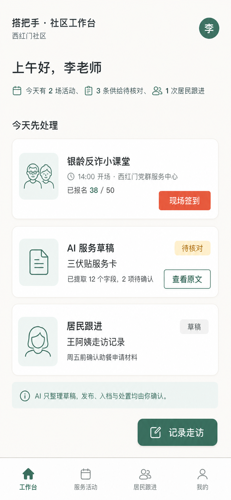
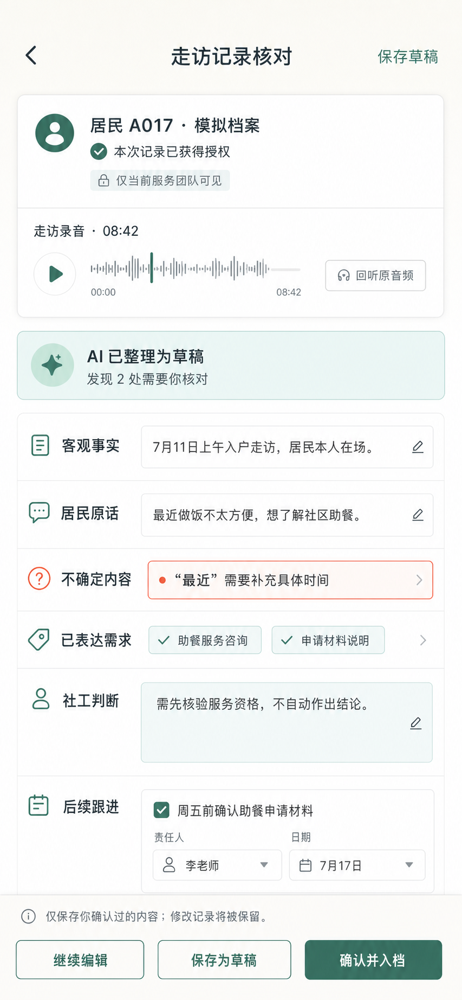
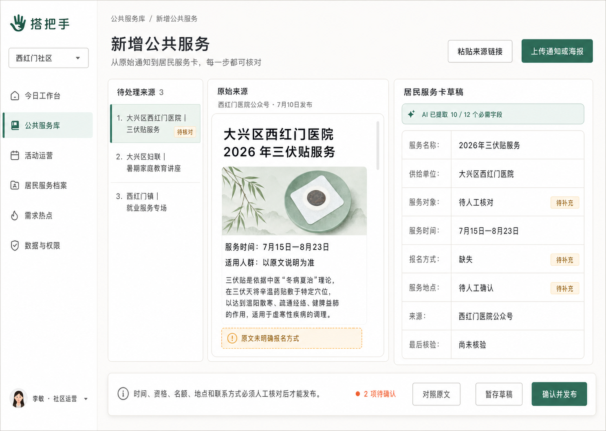
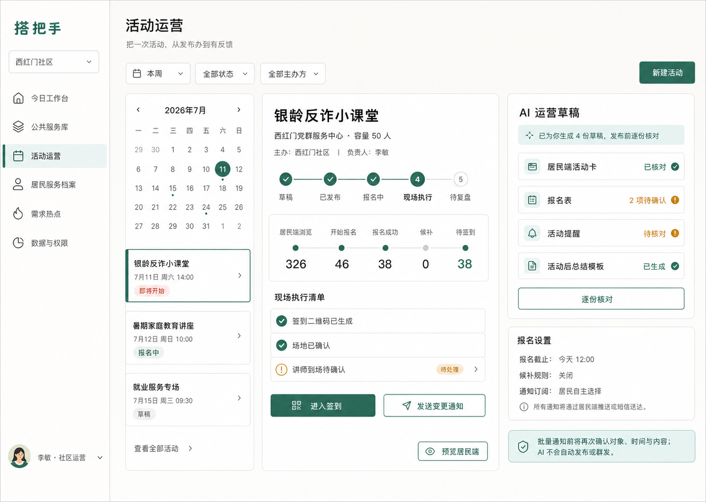
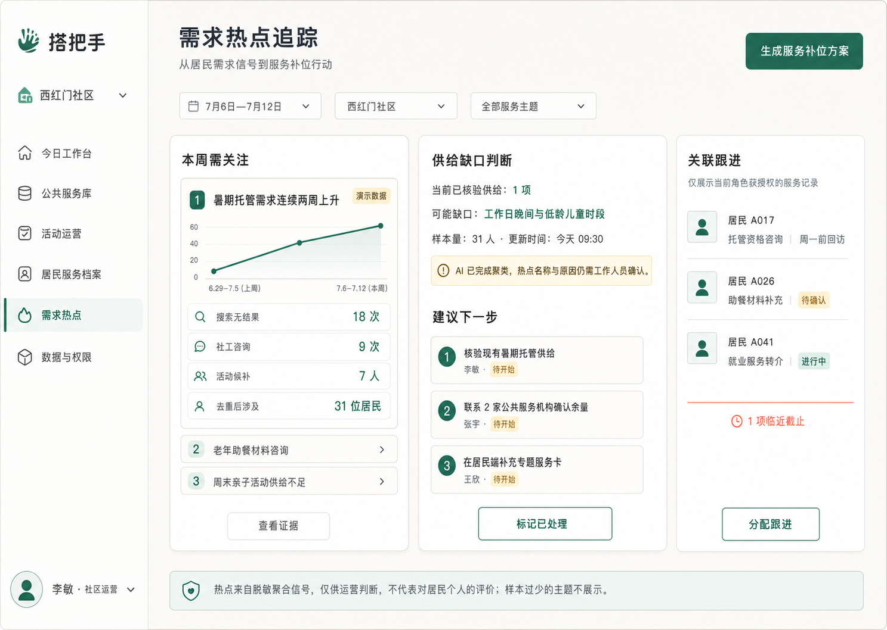

# 待评审｜搭把手 ToG 视觉预览 v0.1

> 状态：供团队讨论初版信息架构与视觉方向，不是最终 UI 稿
>
> 日期：2026-07-11
>
> 对应文档：[手机端 PRD](./待评审_搭把手ToG手机端PRD_v0.1.md)｜[电脑端 PRD](./待评审_搭把手ToG电脑端PRD_v0.1.md)

## 看图前说明

- 这一轮的五张图是一套互补场景，不要求三选一。
- 手机端负责现场执行、走访和轻量核对；电脑端负责供给接入、活动运营与需求分析。
- 视觉暂用暖白、玉石绿、珊瑚橙、12px 圆角和克制的数据表达，后续仍可调整。
- 图片由 AI 辅助生成，局部文字、图标和尺寸只用于表达布局与层级；真实开发以 PRD、设计令牌和组件规范为准。
- 所有活动数字、居民档案和需求热点均为演示数据；真实公共服务必须保留来源与最后核验时间。

---

## 1. 手机端｜今日工作台

核心问题：工作人员今天先做什么？

重点看：活动现场、待核对供给、居民跟进是否能在首屏形成清晰优先级；AI 是否只是嵌入式草稿能力。

---

## 2. 手机端｜走访记录核对

核心问题：AI 能否减轻社工记录负担，同时保留授权、人审与专业判断边界？

重点看：原始录音、客观事实、居民原话、已表达需求、社工判断与后续跟进是否应该分层展示。

---

## 3. 电脑端｜公共服务接入台

核心问题：如何把散落在公众号、官网和机构通知中的服务，转成居民可行动的服务卡？

重点看：待处理来源、原始通知、AI 结构化草稿与底部人工发布区的三栏关系。该屏是比赛版推荐主故事。

---

## 4. 电脑端｜活动运营台

核心问题：社区活动能否从“发过通知”推进到报名、现场执行和复盘？

重点看：活动阶段、报名漏斗、现场执行清单与 AI 运营草稿是否足够清晰；初版只做关键状态，不做真实群发。

---

## 5. 电脑端｜需求热点追踪

核心问题：社区怎样从脱敏居民需求信号中发现供给缺口，并转成下一步行动？

重点看：证据、判断、行动三段式是否比传统数据大屏更适合社区工作人员；关联跟进是否应该保留。

---

## 建议团队集中 Review 的 6 个问题

1. 比赛主链是否确定为“真实服务来源 → AI 草稿 → 人工核验 → 居民端发布”？
2. 手机端 P0 是否只做“今日工作台 + 走访记录核对”？
3. 活动运营和需求热点做到可点击展示，还是各再做一个完整交互？
4. 居民服务档案是否进入本轮，还是仅作为 AI 减负的辅助能力？
5. 手机端是否拥有发布/入档权限，还是统一提交电脑端审核？
6. 暂用视觉风格是否继续进入开发，哪些部分需要在开发前先调整？

## 合并含义

合并本 PR 只会新增两份待评审 PRD、这份视觉索引和五张预览图；不会修改现有 README、居民端代码、数据或部署，也不代表所有功能和视觉已经团队定稿。
